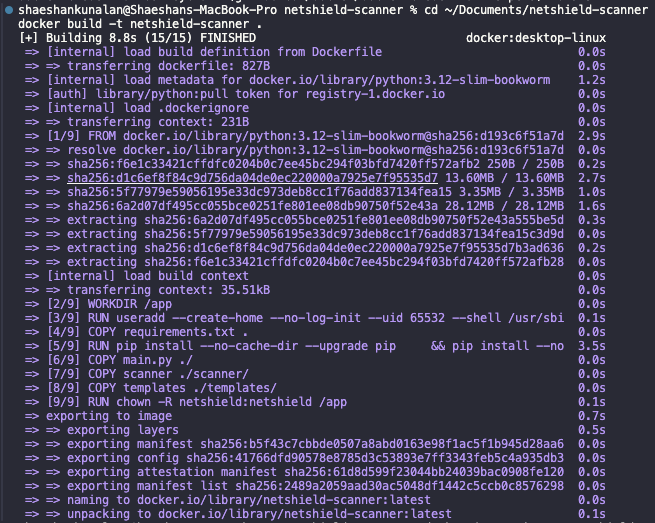
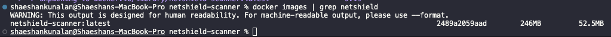
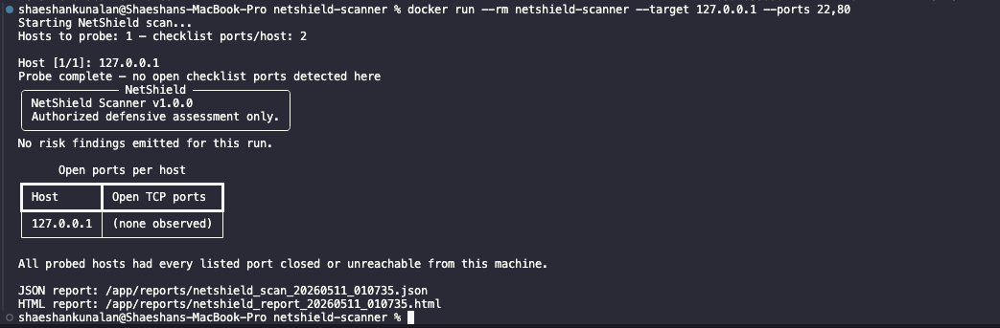
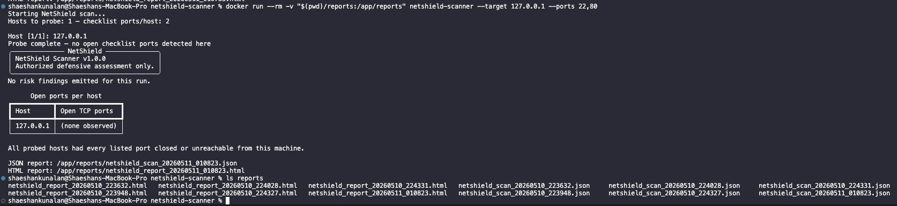
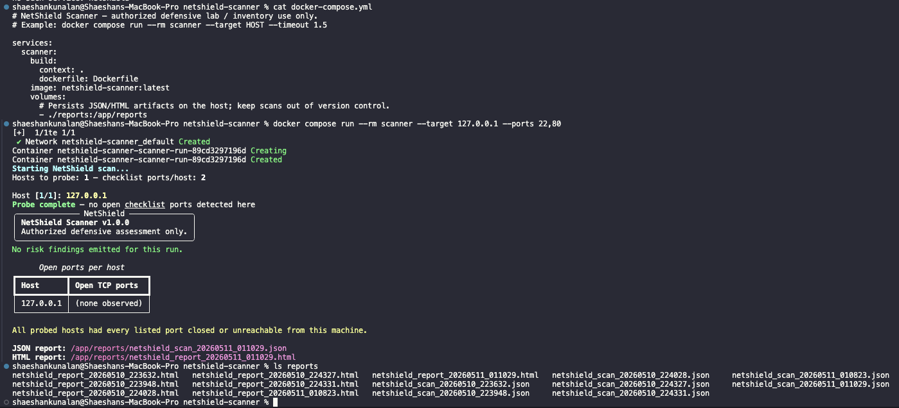
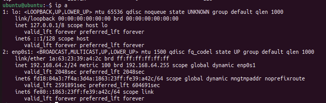
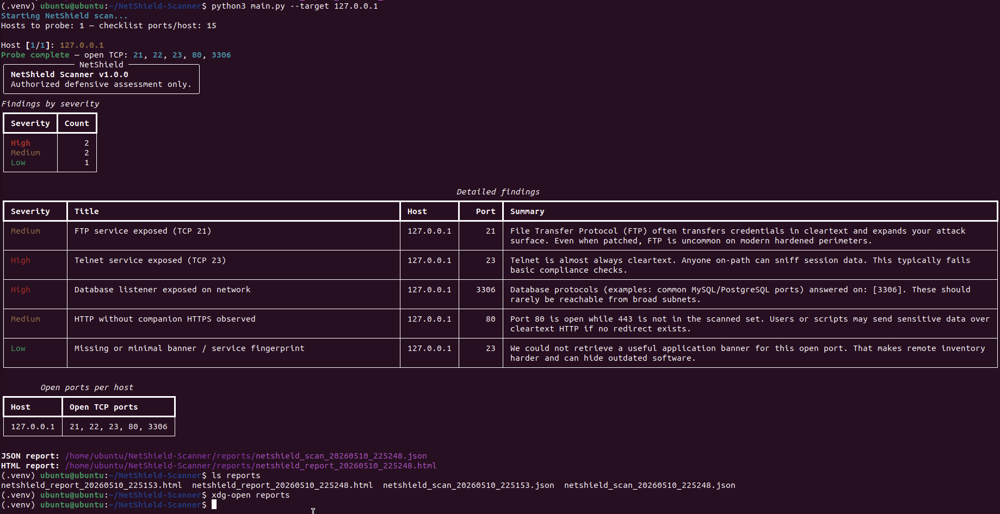
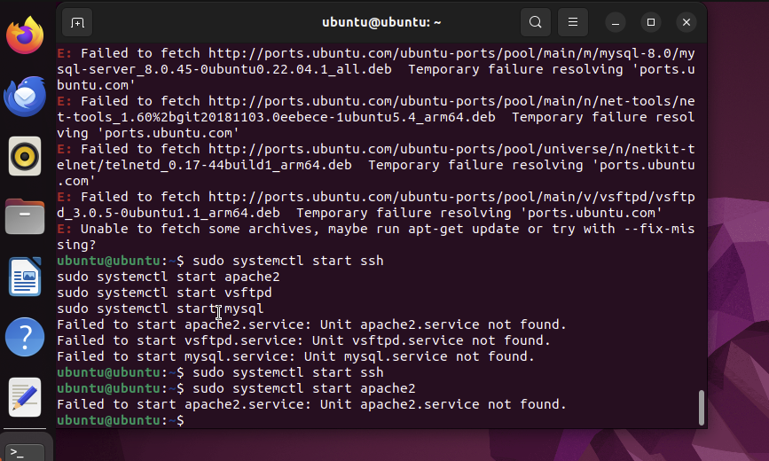
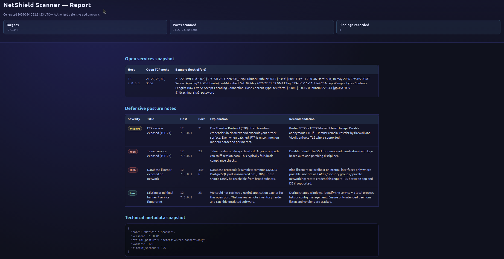
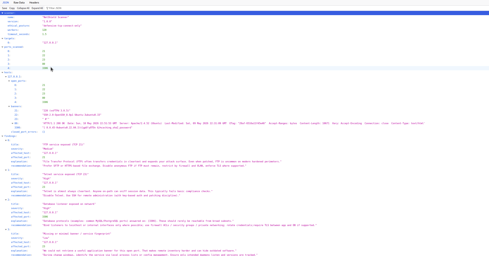

# NetShield Scanner

**NetShield Scanner** is a **defensive** network posture tool for **authorized testing only**. It inventories which common TCP ports accept connections using **explicit TCP connects** (`socket`), performs banner reads that **do not change remote service state**, applies a simple **risk rubric** for defenders, and exports **JSON**, **HTML**, plus a terminal summary via **Rich**.

**Out of scope (not included nor intended):** exploitation, brute forcing, stealth scanning, evasion tactics, credential attacks (or any spraying or guessing), or other offensive tooling. Networking stays at benign connect time behavior comparable to **`telnet` / `nc` checks**, automated with threading and timeouts only.

---

## Features

- **IPv4 host or CIDR input:** expand `192.168.1.0/24` safely with the standard library `ipaddress` module.
- **Default defensive port checklist:** `21,22,23,25,53,80,110,139,143,443,445,3306,3389,5432,8080` (override via `--ports`).
- **Multithreaded TCP probes** using `concurrent.futures.ThreadPoolExecutor`.
- **Banner grabbing** via short, read only socket operations (plus a harmless `HEAD` probe for HTTP style ports).
- **Risk checker** with curated findings (FTP/Telnet/SMB/RDP/DB exposure patterns, HTTP/`HTTPS` posture hint, missing banners).
- **Reports:** timestamped files in `reports/` for JSON and HTML, styled terminal output via **Rich**.
- **Resilient core:** malformed targets are rejected with a message; offline hosts do not crash the run.

---

## Ethical use disclaimer

NetShield Scanner produces **network traffic** (TCP connection attempts). Direct it **only**:

- Toward hosts and networks inside **scopes you own** or are **contractually permitted** to assess, **and**
- In ways consistent with applicable laws and organizational policies.

**Unauthorized scanning is unethical and illegal in many jurisdictions.** If you need practice, prefer **explicitly sanctioned** environments (labs, VMs you control, deliberate vulnerable practice ranges with permission).

Nothing here helps you bypass firewalls covertly or attack third parties. You are responsible for lawful, authorized use only.

---

## Legal notice (not legal advice)

This repository distributes **portfolio / instructional code** related to benign TCP probing. Reading this section is **not** a substitute for professional legal counsel where you operate.

- **No warranty.** The maintainers disclaim warranties to the fullest extent permitted; software is shipped **“AS IS.”** Bugs, misconfigurations, and environment differences are yours to validate.
- **Your compliance.** You alone are responsible for complying with criminal law, contracts, ISP or campus or cloud acceptable use rules, workplace policy, export controls (if relevant), etc.
- **Third party forks and misuse.** This project teaches defensive inventory patterns. Anyone who repurposes code for unlawful access or unauthorized probing acts on their own. **That misuse is outside the authors’ reasonable control**, just as with spreadsheets, compilers, or any general purpose tooling.
- **Scan artifacts.** Logs and HTML and JSON reports can contain banners or IPs; keep them internal (`.gitignore` helps keep them **out** of Git; recheck before every `push`).

If you need definitive answers for employment, coursework, penetration test contracts, international travel, or regulatory regimes, consult a lawyer qualified in **your jurisdiction**.

---

## License

This repository is licensed under the [MIT License](LICENSE). Dependencies (currently **[Rich](https://github.com/Textualize/rich)**) carry their own terms on PyPI.

---

## Installation

Requirements: **Python 3.10+** (uses modern union types like `list[str]`).

```bash
cd /path/to/your-clone
python -m venv .venv

# macOS / Linux
source .venv/bin/activate

# Windows (PowerShell)
# .venv\Scripts\Activate.ps1

python -m pip install -r requirements.txt
```

No third party binaries are required; the scanner uses `socket` from the Python standard library and `rich` for prettier terminal output only.

---

## Docker usage

The image is based on **`python:3.12-slim-bookworm`** with dependencies from **`requirements.txt`**. The process runs **without root privileges** (`netshield` user). Use Docker **only** for **authorized** defensive inventories; the same [**Ethical use disclaimer**](#ethical-use-disclaimer) applies.

**Build:**

```bash
docker build -t netshield-scanner:latest .
```

**Run a scan** (arguments are passed straight through to `python main.py`):

```bash
mkdir -p reports
docker run --rm -v "$(pwd)/reports:/app/reports" netshield-scanner:latest \
  --target 127.0.0.1 --ports 22,80,443 --timeout 1.0
```

Reports appear on your host under **`./reports/`** as timestamped `.json` and `.html`. If you see **`Permission denied`** writing reports, make the folder writable (for example `chmod go+w reports` locally, or **`chown` / ACL** for UID **`65532`**, the container user).

**Compose** (same volume mount):

```bash
mkdir -p reports
docker compose run --rm scanner --target 192.168.56.101 --workers 120
```

**Networking note:** `--target 127.0.0.1` from a default bridge container probes **inside the container**, not your physical host. To inventory the **Docker host**, use an explicit reachable IP for a lab or LAN you control, or on **Linux** add `--network host` to reach host listeners (**authorized** targets only).

---

## Docker validation

Docker support was checked by building the image successfully, running NetShield Scanner inside a container, writing JSON and HTML to the host `reports/` directory through a mounted volume, and invoking the scanner with Docker Compose. All checks were done in a defensive, authorized context.











---

## Usage

Always run commands from the repository root (the folder that contains `scanner/` and `main.py`).

### Scan a single host with the default checklist

```bash
python main.py --target 127.0.0.1
```

### Scan an entire private /24 prefix

```bash
python main.py --target 192.168.1.0/24
```

> Larger ranges mean **more probes** (`hosts × ports`). Exercise patience and restraint on shared networks.

### Override TCP ports explicitly

```bash
python main.py --target 127.0.0.1 --ports 22,80,443
```

### Optional knobs

```bash
# Increase concurrent workers per host (default 120)
python main.py --target 127.0.0.1 --workers 180

# Tighten or loosen per port timeouts (seconds, default ~1.5)
python main.py --target 127.0.0.1 --timeout 1.2
```

### Outputs

Every successful run emits:

- **JSON machine readable results:** `reports/netshield_scan_YYYYMMDD_HHMMSS.json`
- **HTML human readable narrative:** `reports/netshield_report_YYYYMMDD_HHMMSS.html`
- **Styled terminal digest:** printed to stdout (Rich tables and panels)

Open the `.html` file in any browser. Use the `.json` file for ingestion into ticketing systems or Grafana or Splunk demos.

---

## Sample terminal output

```
Starting NetShield scan...
Hosts to probe: 1; checklist ports per host: 15

Host [1/1]: 127.0.0.1

Probe complete: open TCP: 443

********************************************************************
  NetShield Scanner v1.0.0
  Authorized defensive assessment only.
********************************************************************

... Rich tables summarize severities & hosts ...

JSON report: /path/to/your-clone/reports/netshield_scan_20260501_120000.json
HTML report: /path/to/your-clone/reports/netshield_report_20260501_120000.html
```

Your exact wording will mirror whatever services were reachable from your workstation.

Ground truth checks used **`sudo ss -tulnp`** on the Ubuntu guest to correlate listening processes with scanner reported open ports. Lab evidence screenshots are under **`docs/screenshots/`**.

Nothing in this section describes exploiting vulnerabilities or escalating access; it covers **benign connects**, **banner reads**, and **defensive triage narratives**.

---

## Measured results (lab snapshot)

Representative validated run against **`127.0.0.1`** with the default **15 port** checklist:

- **Hosts scanned:** 1 (`127.0.0.1`)
- **TCP ports in checklist:** 15
- **Open checklist ports detected:** 5
- **Listening services (identifiers):** FTP (21), SSH (22), Telnet (23), HTTP (80), MySQL (3306)
- **Generated findings:** 5 (`2 × High`, `2 × Medium`, `1 × Low`)
- **Report formats:** JSON and HTML
- **OS validation command:** `sudo ss -tulnp`

These numbers reflect **that lab snapshot** only; repeat runs depend on what is genuinely listening.

---

## Screenshots

Evidence images live under **`docs/screenshots/`**. Omit committing raw scan reports if they contain banners or fingerprints you prefer not to share.

### 1. Ubuntu services / environment

Listening services, network context (`ip a`), or tooling such as **`sudo ss -tulnp`** showing expected daemons consistent with scanner output.



### 2. Targeted scan (terminal)

Example: run with **`--ports`** narrowed to confirm specific services (narrow scope, faster iterations).



### 3. Full default checklist scan (terminal)

Default **15 port** run against **`127.0.0.1`** including Rich severity summary and report paths under `reports/`.



### 4. HTML report

Browser view of `reports/netshield_report_*.html` (open ports, banners snapshot, defensive notes).



### 5. JSON report

Structured artifact `reports/netshield_scan_*.json` (scanner metadata, ports, banners, findings).



---

## Project layout recap

```
project/
  docs/
    screenshots/           (optional README evidence images)
  scanner/
    __init__.py
    port_scanner.py
    banner_grabber.py
    risk_checker.py
    report_generator.py
  reports/                 (JSON and HTML artifacts; gitignored except .gitkeep)
  templates/
    report.html
  Dockerfile
  docker-compose.yml
  .dockerignore
  .github/workflows/ci.yml
  main.py
  requirements.txt
  README.md
  SECURITY.md
  LICENSE
  .gitignore
```

---

## Risk checker logic (overview)

Every finding includes **title**, **severity** (`Low`, `Medium`, `High`), **affected host**, **affected port** (nullable), **plain language explanation**, and **recommended hardening**:

- TCP 21 reachable: **Medium** (typical)
- TCP 23 reachable: **High**
- TCP 139 and 445 reachable together: **High**
- TCP 3389 reachable: **High**
- Known DB ports reachable (`3306`, `5432` in checklist): **High**
- Port 80 open while **443 was part of your scan scope** yet stays closed: **Medium**
- Open port lacked a recognizable banner fingerprint: **Low**

Interpret severities **qualitatively**; they summarize attack surface sense rather than validating active exploitation.

---

## Future improvements

Curated ideas aligned with defensive goals:

1. IPv6 equivalents with parallel address expansion controls.
2. Optional TLS aware metadata (certificate expiry, SAN coverage) strictly over normal TLS handshakes.
3. Pluggable Nessus compatible JSON or SARIF exporters for SOC demos.
4. Asyncio rewrite for gigantic host sets while respecting rate caps.
5. Configuration file presets for compliance frameworks (PCI, CIS) expressed as declarative YAML.

---

## Support and ethos

Issues in this educational repository boil down to two categories:

1. **Bugs or defects** in parsing, threading, reporting, or documentation (PRs and issues welcome in personal forks).
2. **Requests for offensive tooling:** out of scope; maintain aligned defensive enhancements only.

Lead with empathy, cite authorization, mentor newer analysts transparently. **That** is how this portfolio piece demonstrates professional maturity alongside technical skill.
